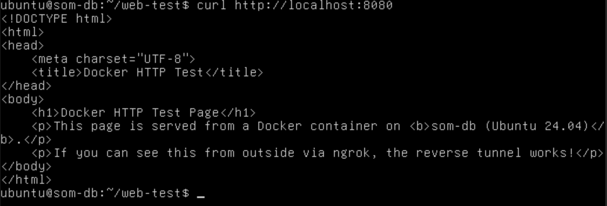
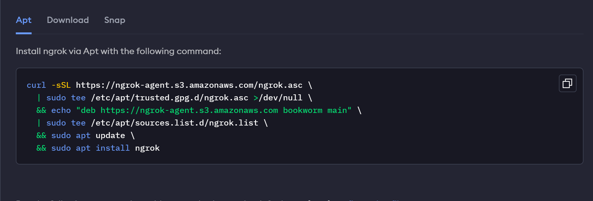
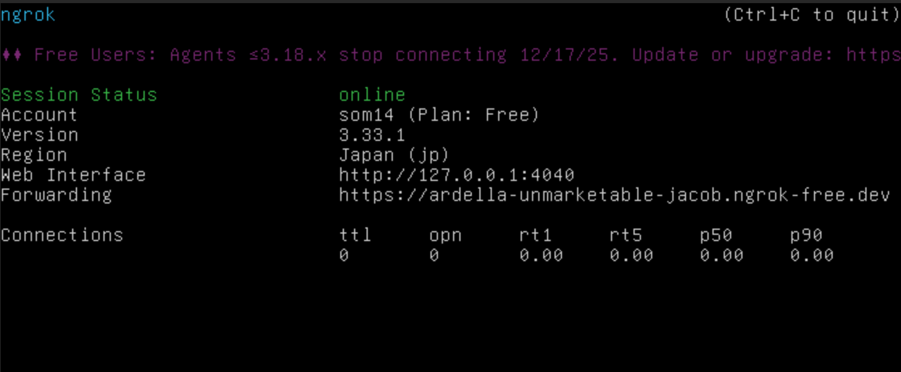
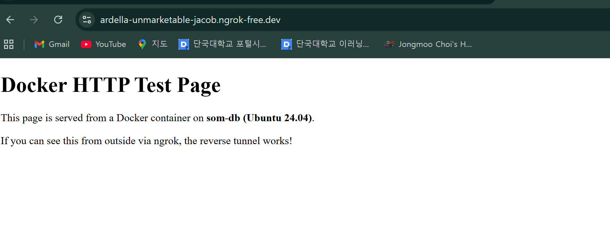
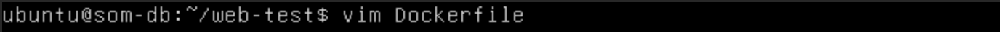
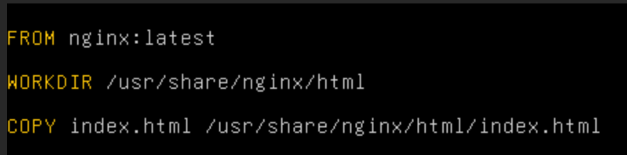
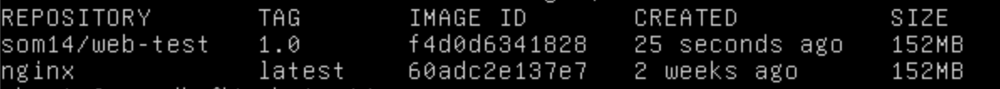
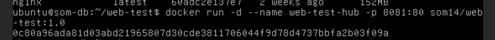
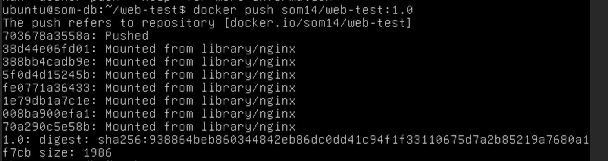
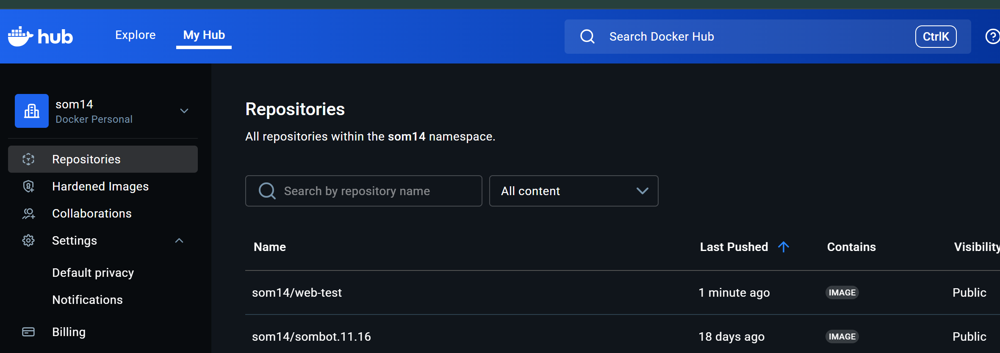

# 도커 시연 보고서

---

## 1. 개요

본 시연의 목적은 다음과 같다.

1. 실습 환경의 토폴로지를 설명한다.
2. Ubuntu 서버에서 Docker를 설치하고 설정하는 과정을 정리한다.
3. Docker Hub 이미지를 활용해 컨테이너를 실행하는 과정을 보여준다.
4. Nginx 컨테이너와 ngrok을 이용해 간단한 웹 서비스 실험을 수행한다.

---

## 2. Topology

### 2.1 Server VM (Linux)

- 하이퍼바이저: KVM  
- VM 이름: `som-db`  
- OS: Ubuntu 24.04 (64-bit)  
- 역할: Docker 실습 및 웹 서버 호스팅


---

### 2.2 Client OS (Windows)

- OS: Windows 10  
- 역할:  
  - 서버에 SSH로 접속  
  - 웹 브라우저로 ngrok URL 접속하여 웹 페이지 확인


---

## 3. 도커 설치 과정

### 3.1 패키지 저장소 업데이트 및 Docker 설치

먼저 패키지 목록을 최신 상태로 업데이트한 뒤, Docker를 설치한다.

```bash
sudo apt update
sudo apt install -y docker.io
````


설치 중 `y/n` 선택이 나오면 `y`를 입력하여 설치를 진행한다.

설치가 완료되면 다음 명령으로 버전을 확인한다.

```bash
docker --version
```


정상적으로 버전 정보가 출력되면 Docker 엔진 설치가 완료된 것이다.

---

### 3.2 Docker 그룹에 사용자 등록

처음 상태에서는 일반 사용자 권한으로 Docker 데몬에 접근할 수 없기 때문에, `docker ps` 실행 시 다음과 같이 권한 오류가 발생한다.


이를 해결하기 위해 현재 사용자를 `docker` 그룹에 추가한다.

```bash
sudo usermod -aG docker $USER
```


그룹 정보가 반영되도록 **시스템을 재부팅**하거나, 현재 세션에서 다음과 같이 새 그룹을 적용할 수 있다.

```bash
newgrp docker
```

또는 로그아웃 후 다시 로그인해도 된다.
이 과정을 거친 뒤에는 `sudo` 없이도 `docker ps`, `docker run` 등을 실행할 수 있다.

---

## 4. 간단한 실험 예제

간단한 실습 시나리오는 다음과 같다.

1. HTML 파일을 작성한다.
2. Nginx 이미지를 기반으로 Docker 컨테이너를 실행하고, 작성한 HTML을 서비스한다.
3. 서버 내부에서 웹 페이지를 확인한다.
4. (선택) ngrok을 사용해 외부 클라이언트에서 해당 페이지에 접속한다.

---

### 4.1 테스트용 HTML 파일 작성

먼저 테스트용 디렉터리를 만들고 그 안에서 HTML 파일을 작성한다.

```bash
mkdir -p ~/web-test
cd ~/web-test
```

디렉터리 생성 후, 다음 명령으로 `index.html` 파일을 생성한다.

```bash
cat > index.html << 'EOF'
<!DOCTYPE html>
<html>
<head>
    <meta charset="UTF-8">
    <title>Docker HTTP Test</title>
</head>
<body>
    <h1>Docker HTTP Test Page</h1>
    <p>This page is served from a Docker container on <b>som-db (Ubuntu 24.04)</b>.</p>
    <p>If you can see this from outside via ngrok, the reverse tunnel works!</p>
</body>
</html>
EOF
```

이 HTML 파일이 이후 Nginx 컨테이너의 기본 페이지로 사용된다.

---

### 4.2 Nginx 컨테이너 실행 (HTTP 80 → 호스트 8080)

다음 명령을 통해 Docker Hub의 `nginx` 이미지를 사용하여 웹 서버 컨테이너를 실행한다.

```bash
docker run -d --name web-test \
  -p 8080:80 \
  -v $PWD/index.html:/usr/share/nginx/html/index.html:ro \
  nginx
```

각 옵션의 의미는 다음과 같다.

* `-d` : 컨테이너를 백그라운드(detached) 모드로 실행
* `--name web-test` : 컨테이너 이름을 `web-test`로 지정
* `-p 8080:80` : 호스트의 8080 포트를 컨테이너의 80 포트에 매핑
* `-v $PWD/index.html:/usr/share/nginx/html/index.html:ro`

  * 현재 디렉터리의 `index.html` 파일을
    컨테이너 내부의 `/usr/share/nginx/html/index.html` 위치에 **읽기 전용(read-only)** 으로 마운트
  * Nginx 기본 페이지를 사용자가 작성한 HTML로 대체

---

### 4.3 서버 내부에서 웹 페이지 확인

컨테이너가 정상적으로 실행 중인지 확인하기 위해 서버 내부에서 다음 명령을 실행한다.

```bash
curl http://localhost:8080
```



출력 내용에 앞에서 작성한 HTML이 보이면 Docker 설정과 Nginx 컨테이너 실행이 정상적으로 완료된 것이다.

---

### 4.4 (선택) ngrok을 이용한 외부 호스팅

실제 배포 환경에서는 Docker 컨테이너를 외부에서 접근 가능하도록 호스팅하는 경우가 많다.
그러나 본 실습 환경의 서버는 **학교 내부망에 위치**하며, 방화벽 설정으로 인해 외부에서 직접 접속하는 **인바운드 트래픽이 차단**되어 있다.

이를 우회하기 위해 **ngrok**을 사용하여 리버스 터널을 구성한다.

#### 4.4.1 ngrok 설치 및 설정

1. [https://ngrok.com/](https://ngrok.com/) 에 접속하여 회원 가입 후 Auth Token을 발급받는다.
2. 제공되는 안내에 따라 바이너리를 설치하고, 설정 파일(`config`)에 토큰을 등록한다.



#### 4.4.2 포트 8080에 대한 HTTP 터널 생성

앞서 Nginx 컨테이너가 **호스트의 8080 포트**에서 서비스 중이므로, 다음 명령을 서버에서 실행한다.

```bash
ngrok http 8080
```

실행 후, 아래와 같이 `Forwarding` 항목에 외부에서 접속 가능한 URL이 표시된다.



예시:

```text
https://<임의의-서브도메인>.ngrok-free.dev
```

#### 4.4.3 클라이언트(Windows)에서 접속 확인

Windows 클라이언트의 웹 브라우저에서 위에서 발급된 ngrok URL에 접속한다.



앞에서 작성한 HTML 페이지가 정상적으로 보이면,

* Docker 컨테이너에서 Nginx가 HTML을 정상적으로 서비스하고 있고,
* ngrok을 통한 리버스 터널을 이용해
  **학교 내부망 서버의 웹 페이지를 외부 인터넷에서 접근할 수 있음을 검증**한 것이다.

---

## 5. Docker Hub 연동: 커스텀 이미지 생성 및 업로드

앞에서는 호스트의 `index.html` 파일을 **볼륨(-v)** 으로 컨테이너에 마운트해서 사용했다.  
이번에는 같은 파일을 **이미지 안에 포함하는 커스텀 Docker 이미지**로 만들고,  
이를 **Docker Hub에 업로드(push)** 한 뒤 다시 내려받아 사용하는 과정을 정리한다.

### 5.1 준비: 기존 HTML 파일 재사용

이미 4.1 절에서 `~/web-test/index.html` 파일을 생성했으므로  
동일한 디렉터리에서 작업을 이어간다.

### 6.2 Dockerfile 작성 (커스텀 Nginx 이미지)

기존에는 공개 이미지 nginx를 그대로 사용하고 볼륨으로 HTML을 덮어씌웠다.
이제는 HTML 파일을 이미지 빌드 단계에서 COPY 하는 방식으로 만든다.  

```
 vim Dockerfile (다른 에디터 있다면 굳이 vim 쓸필요는 x)
```

```
# 베이스 이미지로 공식 nginx 사용
FROM nginx:latest

# 작업 디렉터리 (선택 사항)
WORKDIR /usr/share/nginx/html

# 호스트의 index.html을 컨테이너 내부 기본 페이지로 복사
COPY index.html /usr/share/nginx/html/index.html
```


### 6.3 이미지 빌드 (로컬)

Docker Hub에 올리기 위해 Docker Hub 계정명을 포함한 태그로 이미지를 빌드한다.
아래에서 <dockerhub-id> 부분을 본인의 Docker Hub 계정으로 바꾼다.
```
docker build -t <dockerhub-id>/web-test:1.0 .
```

예시:
```
docker build -t som14/web-test:1.0 .
```

빌드가 완료되면 다음 명령으로 이미지가 생성되었는지 확인한다.
```
docker images
```

<dockerhub-id>/web-test 이름의 이미지가 보이면 성공이다.

### 6.4 커스텀 이미지로 컨테이너 실행 (볼륨 없이)

이제는 이미지 안에 index.html이 포함되어 있으므로,
볼륨 옵션 없이도 동일한 웹 페이지를 서비스할 수 있다.
```
docker run -d --name web-test-hub -p 8081:80 <dockerhub-id>/web-test:1.0
```



서버 내부에서 다음과 같이 확인한다.
```
curl http://localhost:8081
```

출력 결과에 이전과 동일한 HTML이 보이면
커스텀 이미지가 정상적으로 동작하는 것이다.

### 6.5 Docker Hub 로그인 및 이미지 업로드 (push)

먼저 Docker Hub에 로그인한다.
```
docker login
```

프롬프트에 Docker Hub 아이디와 비밀번호를 입력한다.
로그인이 성공하면 다음 명령으로 이미지를 푸시한다.
```
docker push <dockerhub-id>/web-test:1.0
```

예시:
```
docker push som14/web-test:1.0
```


업로드가 완료되면 Docker Hub 웹사이트의 Repositories 메뉴에서
web-test 리포지토리를 확인할 수 있다.
